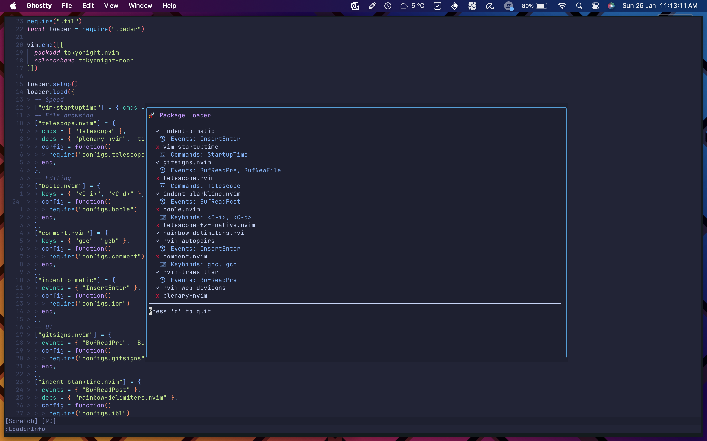

# `loader.nvim 🚀`

`loader.nvim` is a lightweight, minimalistic plugin loader for Neovim designed to integrate seamlessly into a Nixified Neovim configuration. It allows for lazy loading of plugins based on commands, keybindings, or events. This plugin loader is built for use with the `vimplugin-loader.nvim` plugin exposed through the `overlays.default` of a Nix flake.

---

## 🔥 Features

- **Lazy Loading**: Load plugins only when needed (e.g., on command execution, keybinding press, or specific events).
- **Dependency Management**: Automatically load plugin dependencies in the correct order.
- **Customizable UI**: Displays a sleek plugin loader interface with customizable highlights.
- **Nix Integration**: Works seamlessly with `nixpkgs` overlays to define Neovim plugins.
- **Extensible Configurations**: Supports per-plugin configuration.

---

## 📦 Installation

To use `loader.nvim`, include the flake in your `flake.nix` and overlay the `vimplugin-loader.nvim` package. Here's an example configuration:

```nix
{
    pkgs = system: import nixpkgs {
        inherit system;
        overlays = [ inputs.loader.overlays.default ];
    };
}
```

Once the flake is installed, the `vimplugin-loader-nvim` module will be available for use in Neovim.

👉 A minimal example config can be found in the `./example` dir

---

## ✨ Example Configuration

Below is a Lua example of integrating `loader.nvim` into your Neovim configuration.

```lua
-- Import the plugin
local loader = require("loader")

-- Load the plugin and set the `:LoaderInfo` command
loader.setup({
    notifyOnLoad = false, -- Shows a notification each time a plugin is loaded
    highlights = {
        -- Override the default highlight groups
        header = "#c797ff",      -- Header text
        loaded = "#1df914",      -- Loaded plugins
        notLoaded = "#dc143c",   -- Not yet loaded plugins
        Info = "#89b4fa",        -- Additional plugin information
    }
})

-- Define plugins to load
loader.load({
	-- Example with no configuration
	["vim-startuptime"] = { cmds = { "StartupTime" } },

	-- Example with configuration
	["boole.nvim"] = {
		keys = { "<C-i>", "<C-d>" },
		config = function()
			require("boole").setup()
		end,
	},

	-- Example with dependencies
	["indent-blankline.nvim"] = {
		events = { "BufReadPost" },
		deps = { "rainbow-delimiters.nvim" },
		config = function()
			require("configs.ibl")
		end,
	},

	-- Declare dependencies explicitly
	["rainbow-delimiters.nvim"] = {
		config = function()
			require("configs.delims")
		end,
	},
})
```

In this example:

- Plugins are lazily loaded based on `cmds`, `keys`, or `events`.
- Dependencies are declared and automatically loaded in the correct order.
- Each plugin can have an optional `config` function to configure the plugin after it's loaded.

---

## 🛠 Integration with Nix

To declare plugins, use the `packages.<name>.opt` array of the Neovim package override in your Nix configuration. For a full example of how to configure Neovim with Nix and `loader.nvim`, see the [example configuration](https://github.com/NewDawn0/nvimConfig).

---

## 🚀 Commands

- **`:LoaderInfo`**: Opens the plugin loader UI to display the status of all plugins.



---

## 🎨 Customization

`loader.nvim` allows you to customize the UI highlights. Use the `setup` function to override the default highlight groups:

```lua
loader.setup({
	header = "#ff79c6",
	loaded = "#50fa7b",
	notLoaded = "#ff5555",
	info = "#bd93f9",
})
```

---

## 📖 Full Example Nixified Neovim Config

For a complete example of a Nixified Neovim configuration that uses `loader.nvim`, refer to the [NewDawn0/nvimConfig](https://github.com/NewDawn0/nvimConfig) repository.

---

## 🔗 Repository

GitHub: [NewDawn0/loader.nvim](https://github.com/NewDawn0/loader.nvim)

---

## 📝 License

This project is licensed under the MIT License. See the [LICENSE](https://github.com/NewDawn0/loader.nvim/blob/main/LICENSE) file for more details.

---

`loader.nvim` simplifies plugin management for Nixified Neovim setups while keeping things fast and flexible. 🚀 Happy coding!
